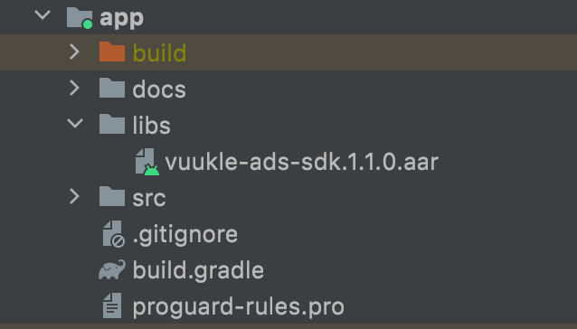
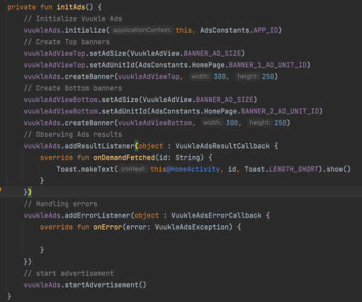

**Implement Vuukle Ads SDK for Android** Click for download apk: [VuukleAdsSample apk file for demo](app/docs/app-debug.apk) 


1. Add **vuukle-ads-sdk.1.0.1** to project **/app/libs**.

   

2. Include Vuukle Ads SDK in **build.gradle**

   ```kotlin
   // Load Vuukle ads sdk
   implementation files('libs/vuukle-ads-sdk.1.1.0.aar')
   ```

3. Implement those libraries in **build.gradle**

   ```kotlin
   implementation 'com.google.android.gms:play-services-ads:21.0.0'
   implementation 'org.prebid:prebid-mobile-sdk:[1,2)'
   ```

4. Reach out to vuukle team on **ad@vuukle.com** to get your Application ID.

```xml
<manifest>
    <application>
        <meta-data
            android:name="com.google.android.gms.ads.APPLICATION_ID"
            android:value="ca-app-pub-7538703090817389~**********"/>
    </application>
	</manifest>
```

4. Add permission in **AndroidManifest.xml**

```xml
<uses-permission android:name="android.permission.INTERNET" />
```

5. Define **VuukleAdView** in layout XML.

```xml
   <?xml version="1.0" encoding="utf-8"?>
<androidx.constraintlayout.widget.ConstraintLayout xmlns:android="http://schemas.android.com/apk/res/android"
    xmlns:app="http://schemas.android.com/apk/res-auto"
    xmlns:ads="http://schemas.android.com/apk/res-auto"
    xmlns:tools="http://schemas.android.com/tools"
    android:layout_width="match_parent"
    android:layout_height="match_parent"
    tools:context=".MainActivity">

   <vuukle.sdk.ads.widget.VuukleAdView
           android:id="@+id/vuukle_ad_view_top"
           android:layout_width="300dp"
           android:layout_height="250dp"
           android:layout_marginTop="8dp"
           app:layout_constraintEnd_toEndOf="parent"
           app:layout_constraintStart_toStartOf="parent"
           app:layout_constraintTop_toTopOf="parent" />

   <vuukle.sdk.ads.widget.VuukleAdView
           android:id="@+id/vuukle_ad_view_bottom"
           android:layout_width="300dp"
           android:layout_height="250dp"
           android:layout_marginBottom="8dp"
           app:layout_constraintBottom_toBottomOf="parent"
           app:layout_constraintEnd_toEndOf="parent"
           app:layout_constraintStart_toStartOf="parent"
           app:layout_constraintTop_toBottomOf="@+id/vuukle_ad_view_top"
           app:layout_constraintVertical_bias="1.0" />

</androidx.constraintlayout.widget.ConstraintLayout>
```

6. Call **initAds** function in activity **onCreate()**. Should provide the App id and specify the corresponding UnitId and AdSize programmatically.



6. Please call the corresponding lifecycle functions in the Activity. We are going to handle the lifecycle from Vuukle ads SDK to the next release.

   ```kotlin
   override fun onPause() {
     super.onPause()
     vuukleAds.pause()
   }
   override fun onResume() {
     super.onResume()
     vuukleAds.resume()
   }
   override fun onDestroy() {
     super.onDestroy()
     vuukleAds.destroy()
   }
   ```